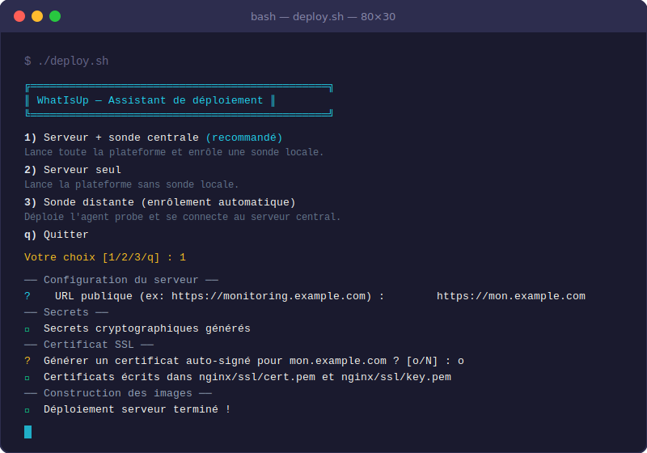

# WhatIsUp

Web monitoring platform with multi-probe geographic correlation, real-time dashboard, alerting, and public status pages.


## Features

- **HTTP/HTTPS monitoring** — status codes, redirect following, response time tracking
- **SSL certificate monitoring** — validity checks, expiry warnings (configurable threshold)
- **Multi-probe architecture** — deploy probes in multiple locations, distinguish global outages from geographic ones
- **Geographic map** — visualise all probes on a Leaflet map; per-monitor probe status map
- **Real-time dashboard** — WebSocket updates, no manual refresh
- **Alerting** — Email (SMTP), Webhook (HMAC-SHA256 signed), Telegram Bot
- **Public status pages** — shareable `yoursite.com/status/my-services`, no login required
- **RBAC** — tag-based permissions (view / edit / admin per tag group)
- **External API** — `GET /api/v1/status/monitors` for third-party integrations
- **One-command deploy** — interactive wizard generates secrets, certs, and starts the stack

## Stack

| Layer | Technology |
|-------|-----------|
| Backend | FastAPI 0.125 + Python 3.12 |
| Database | PostgreSQL 16 + SQLAlchemy 2.0 async |
| Cache / pub-sub | Redis 7 |
| Migrations | Alembic |
| Frontend | Vue.js 3 + Vite + Pinia + Tailwind CSS |
| Charts | ApexCharts |
| Maps | Leaflet 1.9 |
| Probe scheduler | APScheduler 3 |
| Auth | JWT (access 15 min / refresh 7 d) + bcrypt |

---

## Quick Start (Docker — recommended)

```bash
git clone https://github.com/AurevLan/WhatIsUp.git
cd WhatIsUp
docker compose up -d
```

On first start, the server automatically:
1. Runs **Alembic migrations**
2. Creates an **`admin@local`** account with a random strong password
3. Registers **`Central-Probe`** on the same machine (key shared via Docker volume)

```bash
# See the generated admin password and probe status:
docker compose logs server | grep '\[WhatIsUp\]'
```

Open **http://localhost:5173** and log in with `admin@local` and the password from the logs.

> **Change the admin password** on first login via Settings.

---

## Screenshots

### Dashboard — real-time monitor overview


### Monitor detail — availability chart + response time per probe


### Probes — geographic map


### Deployment wizard



---

## Deployment Wizard

The fastest way to deploy in any scenario:

```bash
./deploy.sh
```

```
╔══════════════════════════════════════════════╗
║   WhatIsUp — Assistant de déploiement       ║
╚══════════════════════════════════════════════╝

1) Serveur + sonde centrale   (recommandé)
2) Serveur seul
3) Sonde distante (enrôlement automatique)
q) Quitter
```

| Mode | What it does |
|------|-------------|
| **1 — Server + probe** | Generates secrets, optional self-signed cert, writes `.env`, starts the full stack + `probe-central` via shared volume |
| **2 — Server only** | Same as above without the co-located probe |
| **3 — Remote probe** | Logs into the central API, calls `POST /probes/register`, writes `.env.probe` (chmod 600), starts the probe agent |

Prerequisites: `docker`, `curl`, `python3` (openssl optional, for self-signed certs).

---

## Running Tests

```bash
# Server (11 tests)
cd server && .venv/bin/pytest tests/ -v --tb=short

# Probe (6 tests)
cd probe && .venv/bin/pytest tests/ -v
```

Install dev dependencies if needed:

```bash
cd server && python3 -m venv .venv && .venv/bin/pip install -e ".[dev]"
cd probe  && python3 -m venv .venv && .venv/bin/pip install -e ".[dev]"
```

---

## Production Deployment

### Option A — Deployment wizard (recommended)

```bash
./deploy.sh   # choose option 1 or 2
```

The script generates all secrets, optionally creates a self-signed certificate, and runs `docker compose -f docker-compose.prod.yml [-f docker-compose.central-probe.yml] up -d`.

### Option B — Manual

**1. Prepare environment**

```bash
cp .env.example .env
# Fill in the required values
```

| Variable | Description |
|----------|-------------|
| `POSTGRES_PASSWORD` | PostgreSQL password |
| `REDIS_PASSWORD` | Redis password |
| `SECRET_KEY` | JWT signing secret (≥ 32 chars, random) |
| `FERNET_KEY` | Encryption key for webhook/Telegram secrets |
| `CORS_ALLOWED_ORIGINS` | JSON array of allowed frontend origins |

```bash
# Generate FERNET_KEY:
python3 -c "import base64,os; print(base64.urlsafe_b64encode(os.urandom(32)).decode())"
```

**2. TLS certificate**

Place `cert.pem` and `key.pem` in `nginx/ssl/` (Let's Encrypt or self-signed).
Update `nginx/whatisup.conf` with your `server_name`.

**3. Start the stack**

```bash
# Server only:
docker compose -f docker-compose.prod.yml --env-file .env up -d

# Server + co-located probe (auto-registered):
docker compose -f docker-compose.prod.yml \
               -f docker-compose.central-probe.yml \
               --env-file .env up -d
```

**4. Deploy remote probes**

Use the wizard from any remote server:

```bash
./deploy.sh   # choose option 3
```

Or manually:

```bash
cp .env.probe.example .env.probe
# Fill in CENTRAL_API_URL and PROBE_API_KEY
docker compose -f docker-compose.probe.yml --env-file .env.probe up -d
```

---

## Multi-Probe Geographic Map

Set coordinates on any probe to place it on the map.

In **ProbesView → Carte**, all probes appear as colour-coded markers:
- 🟢 **Green** — online (heartbeat < 2 min ago)
- 🔴 **Red** — offline

In **Monitor detail → Carte**, markers show the last check result for *that specific monitor*:
- 🟢 **Green** — last result `up`
- 🔴 **Red** — `down` / `timeout` / `error`
- ⚫ **Grey** — no check yet from this probe

Edit probe coordinates via the ✏️ button (superadmin only) in ProbesView → Liste.

---

## Architecture

```
                    ┌──────────────────────────────┐
                    │        Nginx (443/80)         │
                    │  TLS termination + reverse    │
                    └─────┬──────────────────┬──────┘
                          │                  │
               ┌──────────▼──────┐  ┌────────▼────────┐
               │  FastAPI server │  │  Vue.js frontend │
               │  :8000          │  │  (built, nginx)  │
               └──────┬──────────┘  └──────────────────┘
                      │
          ┌───────────┼───────────┐
          │           │           │
   ┌──────▼──┐  ┌─────▼───┐  ┌───▼──────────────────────┐
   │Postgres │  │  Redis  │  │  WebSocket pub/sub         │
   │  (DB)   │  │(pub-sub)│  │  (real-time dashboard)     │
   └─────────┘  └─────────┘  └──────────────────────────┘

Probes (deployed anywhere, push results over HTTPS):

  ┌────────────────┐   ┌──────────────┐   ┌──────────────┐
  │  Central-Probe │   │  Probe Paris │   │  Probe Tokyo │
  │  (co-located)  │   │  (remote)    │   │  (remote)    │
  └───────┬────────┘   └──────┬───────┘   └──────┬───────┘
          └───────────────────┼───────────────────┘
                    HTTPS POST /api/v1/probes/results
```

**Incident correlation logic:**
- All probes down → `scope: global` outage
- Some probes down → `scope: geographic` outage
- All probes up → incident resolved automatically

---

## API Documentation

Available at **http://localhost:8000/api/docs** (development mode only — disabled in production).

---

## Security

- Rate-limited endpoints: 10 req/min on auth, 30 req/min on probe results
- All HTTP responses include security headers (CSP, HSTS, X-Frame-Options, …)
- Probe API keys stored as bcrypt hashes; shown in plain text only once
- Webhook secrets encrypted at rest with Fernet
- First-boot admin password generated with `secrets.choice` (cryptographically secure)
- `.env` files written with `chmod 600` by the deployment wizard

See [SECURITY.md](SECURITY.md) for vulnerability reporting and responsible disclosure policy.

---

## CI / Security scanning

| Check | Trigger |
|-------|---------|
| Lint (`ruff`) | Push / PR to `main` |
| Server tests (`pytest`) | Push / PR to `main` |
| Probe tests (`pytest`) | Push / PR to `main` |
| `pip-audit` (server + probe) | Push / PR + weekly |
| `npm audit` (frontend) | Push / PR + weekly |

---

## Contributing

1. Fork → feature branch → PR against `main`
2. Fill in the PR template (security checklist mandatory)
3. All CI checks must pass before merge
